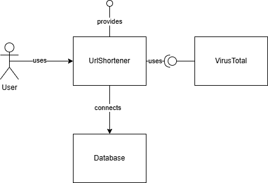
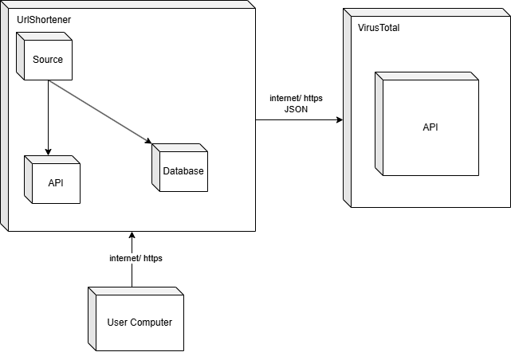
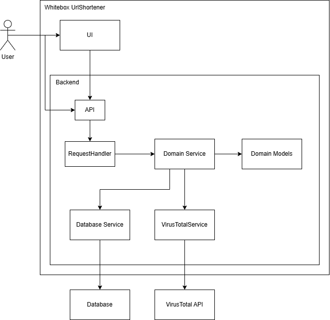

**About arc42**

arc42, the template for documentation of software and system
architecture.

Template Version 8.2 EN. (based upon AsciiDoc version), January 2023

Created, maintained and © by Dr. Peter Hruschka, Dr. Gernot Starke and
contributors. See https://arc42.org.

.. _section-introduction-and-goals:

Introduction and Goals
======================

.. _`_requirements_overview`:

Requirements Overview
---------------------
In the summer semester of 2025, as part of the Master's program INF-M SSE (specialization in Software and Systems Engineering), a small standalone application must be developed in the Software Quality Assurance (SQS) course. This application consists of the application itself with a connection to a database, is linked to an external system, and provides its own API, which can be accessed via an HTML page.

.. _`_quality_goals`:

Quality Goals
-------------
The application should achieve the following quality goals (QG):

.. list-table::
   :header-rows: 1
   :widths: 10 20 70

   * - Priority
     - Quality Goal
     - Scenario
   * - 1
     - Reliability
     - - The system performs functions under the specified conditions and environments.
       - Low "mean time to recovery" and a small number of failures.
   * - 2
     - Maintainability
     - - The system can be modified to improve, correct, or adapt it to changing needs.
       - If another developer takes over, they can add features and improvements.
   * - 3
     - Usability
     - - The system can be understood, learned, and used, and is attractive to users.
       - A user should be able to use it without an introduction.
       - Interfaces and functions should be self-explanatory or provide direct help.
   * - 4
     - Portability
     - - The system can be transferred to different environments.
       - It should be platform-independent.

.. _`_stakeholders`:

Stakeholders
------------

.. list-table::
   :header-rows: 1
   :widths: 20 20 60

   * - Role/Name
     - Contact
     - Expectations
   * - Dozent
     - Felix Rampf
     - - A functioning application that complies with the specified quality objectives.
       - Adheres to other SQS aspects.
   * - Student/Developer
     - Lucas Weiss
     - - High learning effects in the area of SQS and Python.
       - A functioning application with the specified quality goals.
   * - User
     - 
     - - The system works.
       - It is user-friendly.
       - It meets the expectations that users have of the system.
   * - VirusTotal API
     - https://www.virustotal.com/
     - - Use of the API in accordance with the provider's specifications.

.. _section-architecture-constraints:

Architecture Constraints
========================
Technical Aspects
-----------------
- Development using Docker (associated OS in Docker is Linux - Ubuntu)
- Backend programming language: C#
- Backend framework: ASP.NET 9.0
- Database: MS SQL
- External system: https://www.virustotal.com/
- Frontend programming language: TypeScript
- Frontend framework: Vue.js

Organizational Aspects
----------------------
- Time: 24.06.25 - software submission deadline
- Budget: no financial interest
- Documents and materials from the SQA lecture influence the development

.. _section-context-and-scope:

Context and Scope
=================

.. _`_business_context`:

Business Context
----------------

.. list-table::
   :header-rows: 1
   :widths: 20 80

   * - Neighbour
     - Description
   * - User
     - 
       - This is where the input for the application is generated.
       - Uses the UrlShortener interface indirectly.
       - Accesses the UrlShortener system directly.
   * - VirusTotal
     - 
       - Provides an API to check URLs.
       - Uses multiple virus scanners.
   * - SQL Database
     - 
       - UrlShortener saves Users and URLs in a database.

.. _`_technical_context`:

Technical Context
-----------------

.. list-table::
   :header-rows: 1
   :widths: 20 80

   * - Neighbour
     - Interface
   * - User
     - Provides a URL to shorten; provides input data via a user interface.
   * - UrlShortener
     - Provides the user an interface that can be accessed using a browser.
   * - Database
     - Connects via a connection string; exchanges SQL queries through a connector.
   * - VirusTotal
     - Receives JSON requests via HTTPS and API key; returns the response as JSON.

**<Mapping Input/Output to Channels>**

.. list-table::
   :header-rows: 1
   :widths: 20 80

   * - Neighbour
     - Mapping
   * - VirusTotal
     - 
       - Authentification of a request via ApiKey
       - VirusTotal analyzes a URL for potential malware, phishing, or other security threats using various antivirus engines and security services.

.. _section-solution-strategy:

Solution Strategy
=================

.. list-table::
   :header-rows: 1
   :widths: 25 75

   * - Aspect
     - Description
   * - Architecture style
     - Monolithic backend following Clean Architecture principles
   * - Backend technology
     - ASP.NET Core with MediatR pattern for decoupled business logic
   * - Containerization
     - Docker is used to ensure portability and consistent deployment
   * - Frontend
     - Developed using Vue.js with TypeScript
   * - External system
     - VirusTotal API is integrated for verifying the safety of shortened URLs
   * - Database
     - SQL Server is used for persistent data storage

.. _section-building-block-view:

Building Block View
===================

.. _`_whitebox_overall_system`:

Whitebox Overall System
-----------------------

Motivation
   This diagram provides an overview of the main building blocks of the UrlShortener system, including user interaction, API entry point, internal services, and external system integrations.

Contained Building Blocks
   - UI: Vue.js frontend interacting with the API
   - API: ASP.NET Core Minimal API
   - RequestHandler: Entry point for business logic
   - Domain Service: Central logic layer coordinating operations
   - Database Service / VirusTotalService: Infrastructure interfaces
   - Domain Models: Core business objects
   - External: SQL Server and VirusTotal API

Important Interfaces
   *<Description of important interfaces>*

.. _`__name_black_box_1`:

<Name black box 1>
~~~~~~~~~~~~~~~~~~

*<Purpose/Responsibility>*

*<Interface(s)>*

*<(Optional) Quality/Performance Characteristics>*

*<(Optional) Directory/File Location>*

*<(Optional) Fulfilled Requirements>*

*<(optional) Open Issues/Problems/Risks>*

.. _`__name_black_box_2`:

<Name black box 2>
~~~~~~~~~~~~~~~~~~

*<black box template>*

.. _`__name_black_box_n`:

<Name black box n>
~~~~~~~~~~~~~~~~~~

*<black box template>*

.. _`__name_interface_1`:

<Name interface 1>
~~~~~~~~~~~~~~~~~~

…

.. _`__name_interface_m`:

<Name interface m>
~~~~~~~~~~~~~~~~~~

.. _`_level_2`:

Level 2
-------

.. _`_white_box_emphasis_building_block_1_emphasis`:

White Box *<building block 1>*
~~~~~~~~~~~~~~~~~~~~~~~~~~~~~~

*<white box template>*

.. _`_white_box_emphasis_building_block_2_emphasis`:

White Box *<building block 2>*
~~~~~~~~~~~~~~~~~~~~~~~~~~~~~~

*<white box template>*

…

.. _`_white_box_emphasis_building_block_m_emphasis`:

White Box *<building block m>*
~~~~~~~~~~~~~~~~~~~~~~~~~~~~~~

*<white box template>*

.. _`_level_3`:

Level 3
-------

.. _`_white_box_building_block_x_1`:

White Box <_building block x.1_>
~~~~~~~~~~~~~~~~~~~~~~~~~~~~~~~~

*<white box template>*

.. _`_white_box_building_block_x_2`:

White Box <_building block x.2_>
~~~~~~~~~~~~~~~~~~~~~~~~~~~~~~~~

*<white box template>*

.. _`_white_box_building_block_y_1`:

White Box <_building block y.1_>
~~~~~~~~~~~~~~~~~~~~~~~~~~~~~~~~

*<white box template>*

.. _section-runtime-view:

Runtime View
============

.. _`__runtime_scenario_1`:

<Runtime Scenario 1>
--------------------

-  *<insert runtime diagram or textual description of the scenario>*

-  *<insert description of the notable aspects of the interactions
   between the building block instances depicted in this diagram.>*

.. _`__runtime_scenario_2`:

<Runtime Scenario 2>
--------------------

.. _`_`:

…
-

.. _`__runtime_scenario_n`:

<Runtime Scenario n>
--------------------

.. _section-deployment-view:

Deployment View
===============

.. _`_infrastructure_level_1`:

Infrastructure Level 1
----------------------

**<Overview Diagram>**

Motivation
   *<explanation in text form>*

Quality and/or Performance Features
   *<explanation in text form>*

Mapping of Building Blocks to Infrastructure
   *<description of the mapping>*

.. _`_infrastructure_level_2`:

Infrastructure Level 2
----------------------

.. _`__emphasis_infrastructure_element_1_emphasis`:

*<Infrastructure Element 1>*
~~~~~~~~~~~~~~~~~~~~~~~~~~~~

*<diagram + explanation>*

.. _`__emphasis_infrastructure_element_2_emphasis`:

*<Infrastructure Element 2>*
~~~~~~~~~~~~~~~~~~~~~~~~~~~~

*<diagram + explanation>*

…

.. _`__emphasis_infrastructure_element_n_emphasis`:

*<Infrastructure Element n>*
~~~~~~~~~~~~~~~~~~~~~~~~~~~~

*<diagram + explanation>*

.. _section-concepts:

Cross-cutting Concepts
======================

.. _`__emphasis_concept_1_emphasis`:

*<Concept 1>*
-------------

*<explanation>*

.. _`__emphasis_concept_2_emphasis`:

*<Concept 2>*
-------------

*<explanation>*

…

.. _`__emphasis_concept_n_emphasis`:

*<Concept n>*
-------------

*<explanation>*

.. _section-design-decisions:

Architecture Decisions
======================

.. _section-quality-scenarios:

Quality Requirements
====================

.. _`_quality_tree`:

Quality Tree
------------

.. _`_quality_scenarios`:

Quality Scenarios
-----------------

.. _section-technical-risks:

Risks and Technical Debts
=========================

.. _section-glossary:

Glossary
========

+-----------------------+-----------------------------------------------+
| Term                  | Definition                                    |
+=======================+===============================================+
| *<Term-1>*            | *<definition-1>*                              |
+-----------------------+-----------------------------------------------+
| *<Term-2>*            | *<definition-2>*                              |
+-----------------------+-----------------------------------------------+

.. |arc42| image:: images/arc42-logo.png

