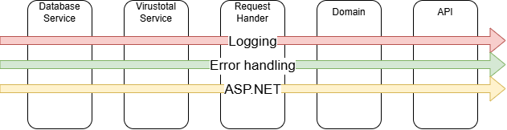

**About arc42**

arc42, the template for documentation of software and system
architecture.

Template Version 8.2 EN. (based upon AsciiDoc version), January 2023

Created, maintained and © by Dr. Peter Hruschka, Dr. Gernot Starke and
contributors. See https://arc42.org.

.. _section-introduction-and-goals:

Introduction and Goals
======================

.. _`_requirements_overview`:

Requirements Overview
---------------------
In the summer semester of 2025, as part of the Master's program INF-M SSE (specialization in Software and Systems Engineering), a small standalone application must be developed in the Software Quality Assurance (SQS) course. This application consists of the application itself with a connection to a database, is linked to an external system, and provides its own API, which can be accessed via an HTML page.

.. _`_quality_goals`:

Quality Goals
-------------
The application should achieve the following quality goals (QG):

.. list-table::
   :header-rows: 1
   :widths: 10 20 70

   * - Priority
     - Quality Goal
     - Scenario
   * - 1
     - Reliability
     - - The system performs functions under the specified conditions and environments.
       - Low "mean time to recovery" and a small number of failures.
   * - 2
     - Maintainability
     - - The system can be modified to improve, correct, or adapt it to changing needs.
       - If another developer takes over, they can add features and improvements.
   * - 3
     - Usability
     - - The system can be understood, learned, and used, and is attractive to users.
       - A user should be able to use it without an introduction.
       - Interfaces and functions should be self-explanatory or provide direct help.
   * - 4
     - Portability
     - - The system can be transferred to different environments.
       - It should be platform-independent.

.. _`_stakeholders`:

Stakeholders
------------

.. list-table::
   :header-rows: 1
   :widths: 20 20 60

   * - Role/Name
     - Contact
     - Expectations
   * - Dozent
     - Felix Rampf
     - - A functioning application that complies with the specified quality objectives.
       - Adheres to other SQS aspects.
   * - Student/Developer
     - Lucas Weiss
     - - High learning effects in the area of SQS and Python.
       - A functioning application with the specified quality goals.
   * - User
     - 
     - - The system works.
       - It is user-friendly.
       - It meets the expectations that users have of the system.
   * - VirusTotal API
     - https://www.virustotal.com/
     - - Use of the API in accordance with the provider's specifications.

.. _section-architecture-constraints:

Architecture Constraints
========================
Technical Aspects
-----------------
- Development using Docker (associated OS in Docker is Linux - Ubuntu)
- Backend programming language: C#
- Backend framework: ASP.NET 9.0
- Database: MS SQL
- External system: https://www.virustotal.com/
- Frontend programming language: TypeScript
- Frontend framework: Vue.js

Organizational Aspects
----------------------
- Time: 24.06.25 - software submission deadline
- Budget: no financial interest
- Documents and materials from the SQA lecture influence the development

.. _section-context-and-scope:

Context and Scope
=================

.. _`_business_context`:

Business Context
----------------

.. image:: _static/BusinessContext.png
   :width: 600px
   :align: center

.. list-table::
   :header-rows: 1
   :widths: 20 80

   * - Neighbour
     - Description
   * - User
     - 
       - This is where the input for the application is generated.
       - Uses the UrlShortener interface indirectly.
       - Accesses the UrlShortener system directly.
   * - VirusTotal
     - 
       - Provides an API to check URLs.
       - Uses multiple virus scanners.
   * - SQL Database
     - 
       - UrlShortener saves Users and URLs in a database.

.. _`_technical_context`:

Technical Context
-----------------

.. list-table::
   :header-rows: 1
   :widths: 20 80

   * - Neighbour
     - Interface
   * - User
     - Provides a URL to shorten; provides input data via a user interface.
   * - UrlShortener
     - Provides the user an interface that can be accessed using a browser.
   * - Database
     - Connects via a connection string; exchanges SQL queries through a connector.
   * - VirusTotal
     - Receives JSON requests via HTTPS and API key; returns the response as JSON.

**<Mapping Input/Output to Channels>**

.. list-table::
   :header-rows: 1
   :widths: 20 80

   * - Neighbour
     - Mapping
   * - VirusTotal
     - 
       - Authentification of a request via ApiKey
       - VirusTotal analyzes a URL for potential malware, phishing, or other security threats using various antivirus engines and security services.

.. _section-solution-strategy:

Solution Strategy
=================

.. list-table::
   :header-rows: 1
   :widths: 25 75

   * - Aspect
     - Description
   * - Architecture style
     - Monolithic backend following Clean Architecture principles
   * - Backend technology
     - ASP.NET Core with MediatR pattern for decoupled business logic
   * - Containerization
     - Docker is used to ensure portability and consistent deployment
   * - Frontend
     - Developed using Vue.js with TypeScript
   * - External system
     - VirusTotal API is integrated for verifying the safety of shortened URLs
   * - Database
     - SQL Server is used for persistent data storage

.. _section-building-block-view:

Building Block View
===================

.. _`_whitebox_overall_system`:

Whitebox Overall System
-----------------------

Motivation
   This diagram provides an overview of the main building blocks of the UrlShortener system, including user interaction, API entry point, internal services, and external system integrations.

Contained Building Blocks
   - UI: Vue.js frontend interacting with the API
   - API: ASP.NET Core Minimal API
   - RequestHandler: Entry point for business logic
   - Domain Service: Central logic layer coordinating operations
   - Database Service / VirusTotalService: Infrastructure interfaces
   - Domain Models: Core business objects
   - External: SQL Server and VirusTotal API

.. _`__name_black_box_1`:

UI
~~~~~~~~~~~~~~~~~~

*Purpose:*
  - Provides the user interface for interacting with the UrlShortener system. Users can submit URLs for shortening and view scan results via a web-based frontend.

*Quality:*
  - High usability and responsiveness  
  - Works across modern browsers  
  - Easy to extend with new features  

*Technology:*
  - Vue.js with TypeScript, bundled via Vite

*Directory:*
  - Located in the `/frontend/` directory. Built with Vue.js and TypeScript, and deployed as a static web app.

.. _`__name_black_box_2`:

API
~~~~~~~~~~~~~~~~~~

*Purpose:*  
  - Exposes HTTP endpoints for the frontend and the user to interact with the system.

*Quality Attributes:*  
  - Fast and lightweight (implemented using ASP.NET Core Minimal APIs)  
  - Follows REST principles  
  - Secure communication via HTTPS  
    - Easily testable and maintainable through the use of MediatR for request handling

*Technology:*  
  - ASP.NET 9.0 with Minimal Apis using Carter

*Directory:*  
  - Located in the `/backend/src/UrlShortener.Presentation/` directory. Deployed as a containerized ASP.NET Core application (Dockerized).

.. _`__name_black_box_3`:

RequestHandler
~~~~~~~~~~~~~~~~~~
*Purpose:* 
  - Acts as the entry point for all application use cases (MediatR handlers). Receives incoming MediatR requests and delegates them to the appropriate domain services.

*Quality Attributes:*  
  - Highly decoupled from other layers  
  - Facilitates separation of concerns  
  - Testable and scalable  

*Technology:*  
  - Using the Mediator pattern with MediatR

*Directory*  
  - Located in the `/backend/src/UrlShortener.Application/` directory. Each use case is implemented as a separate handler class.

.. _`__name_black_box_4`:

Domain Service
~~~~~~~~~~~~~~~~~~
*Purpose:* 
  - Defines the core business operations of the application. Serves as the central abstraction for coordinating complex workflows such as URL shortening and threat analysis. Contains only interface definitions to decouple business logic from infrastructure.

*Quality Attributes:*  
  - Reusable  
  - Promotes testability and loose coupling  
  - Facilitates separation of concerns by delegating implementation to other layers

*Technology:*  
  - Result pattern instead of Exceptions

*Directory*  
  - Located in the `/backend/src/UrlShortener.Domain/` directory.

.. _`__name_black_box_5`:

Domain Models
~~~~~~~~~~~~~~~~~~
*Purpose:*  
  - Encapsulates the core business entities and value objects, such as `Url`, `ScanResult`, or `User`.

*Quality Attributes:*  
  - Independent of frameworks and infrastructure  

*Directory* 
  - Located in the `/backend/src/UrlShortener.Domain/` directory. Used across the application, including handlers, services, and persistence implementations.

.. _`__name_black_box_6`:

Database Service
~~~~~~~~~~~~~~~~~~
*Purpose:*  
  - Handles direct access to the relational database using Entity Framework Core. Provides access to application data (e.g., URLs, Users) by exposing `DbSet<T>` collections to the application layer.

*Quality Attributes:*  
  - Strongly typed and LINQ-integrated queries  
  - Tight coupling to EF Core but simplifies data access  
  - Low boilerplate due to lack of repository or abstraction layers

*Technology:*  
  - Ef Core 9.0
  - Microsoft Identity for usermanagement

*Directory*  
  - Located in the `/backend/src/UrlShortener.Persistence/` directory.

.. _`__name_black_box_7`:

Virustotal Service
~~~~~~~~~~~~~~~~~~
*Purpose:*  
  - Provides integration with the external VirusTotal API. Responsible for submitting URLs for analysis and retrieving scan results.

*Quality Attributes:*  
  - Isolated and encapsulated communication with the external API  
  - Fault-tolerant
  - Easily replaceable or mockable for testing purposes  

*Technology:*  
  - Refit for Http requests

*Directory*  
  - Located in the /backend/src/UrlShortener.Infrastructure/` directory. Used by application handlers to initiate and process external virus scans.

.. _`__name_black_box_8`:

Database
~~~~~~~~~~~~~~~~~~
*Purpose:*  
  - Stores all persistent data for the UrlShortener system, including shortened URLs and Users.

*Technology:*  
  - Microsoft SQL Server

*Quality Attributes:*  
  - Relational consistency and ACID guarantees  
  - Supports complex queries and indexing  
  - Well-integrated with .NET and EF Core tooling

*Directory*  
  - Provisioned via Docker; connection configured through environment variables in the backend.

.. _`__name_black_box_9`:

VirusTotal API
~~~~~~~~~~~~~~~~~~
*Purpose:*  
  - External service used to analyze submitted URLs for threats such as malware, phishing, or suspicious behavior.

*Technology:*
  - Public HTTP REST API provided by VirusTotal.

*Quality Attributes:*  
  - Asynchronous HTTP communication  
  - JSON-based requests and responses  
  - Requires API key and rate-limited access 

*Directory*  
  - Accessible via https://www.virustotal.com/

Runtime View
============

.. _section-deployment-view:

Deployment View
===============

.. _`_infrastructure_level_1`:

Infrastructure Level 1
----------------------

Motivation
~~~~~~~~~~

The application's infrastructure has been virtualized using Docker containers. This allows maintainers and developers to set up and operate the project independently of the host platform. Security aspects are addressed through Infrastructure as Code (e.g., Dockerfiles). This infrastructure also supports scalability: when a container reaches its limits, more resources can be allocated or a new container can be spawned. In addition, the system achieves higher fault tolerance. With Docker containers, multiple applications can reside in the same network and wait for user input.

Quality and/or Performance Features
~~~~~~~~~~~~~~~~~~~~~~~~~~~~~~~~~~~

- **Fault tolerance:** Multiple containers of the application can be spawned to take over the load in case of a failure. The application remains online.
- **Scalability:** The application container can be duplicated and run within the same network. The containers operate independently.
- **Maintainability:** The application can be migrated in the background while it is still running. After the migration is complete, containers are restarted one by one — invisible to the user.

Mapping of Building Blocks to Infrastructure
~~~~~~~~~~~~~~~~~~~~~~~~~~~~~~~~~~~~~~~~~~~~

- The **Application Container** communicates via a native database connection with the **Database Container** through the component **Database Connection**.
- The **Application Container** communicates over the internet with the external third-party API **VirusTotal API**.
- The **User's Computer** communicates with the **Application Container** via HTTP over the internet using a web browser.

Cross-cutting Concepts
======================

.. _`__emphasis_concept_1_emphasis`:

Logging
-------

The application uses structured logging to capture runtime behavior and diagnostics. All layers (API, application, and infrastructure) log significant actions and errors. Serilog is used as the primary logging library, and log messages include contextual information (e.g., request IDs, user IDs, exceptions). Logs can be routed to the console, files, or external log aggregation systems (e.g., Seq or Grafana Loki) depending on the environment.

This improves traceability, debugging, and auditability

.. _`__emphasis_concept_2_emphasis`:

Error Handling
--------------

The application uses a centralized error-handling strategy. Business rule violations are represented using result types instead of exceptions.

Validation errors, unauthorized access, and external API failures are properly logged and surfaced with appropriate HTTP status codes (e.g., 400, 401, 500), ensuring both developer insight and user-friendly feedback.

.. _`__emphasis_concept_3_emphasis`:

ASP.NET Framework
-----------------

The backend is built using ASP.NET Core 9.0 and follows Clean Architecture principles. Minimal APIs are used to keep the HTTP interface lightweight, and dependency injection is leveraged throughout the application.

MediatR is integrated to decouple application logic, and configuration is handled using strongly typed settings. The framework supports HTTPS by default, integrates easily with Docker, and provides built-in support for middleware, authentication, and environment-specific setups.

.. _section-design-decisions:

Architecture Decisions
======================

.. list-table::
   :header-rows: 1
   :widths: 20 80

   * - **Category**
     - **Note**

   * - Title
     - Programming Language of the Application
   * - Context
     - What programming language should the application be developed in? Options include Java, .NET, Typescript or Python.
   * - Decision
     - .NET 9.0
   * - Status
     - accepted
   * - Consequences
     - The application will be implemented in .NET 9.0.

   * - Title
     - Web Framework for the Backend
   * - Context
     - Which web framework will be used to build the HTTP API?
   * - Decision
     - ASP.NET 9.0
   * - Status
     - accepted
   * - Consequences
     - The backend will use ASP.NET 9.0 with Minimal APIs for lightweight and fast request handling.

   * - Title
     - Containerization and Deployment
   * - Context
     - How will the application be deployed and run in different environments?
   * - Decision
     - Docker
   * - Status
     - accepted
   * - Consequences
     - The application will be containerized using Docker for consistent deployment across environments.

   * - Title
     - Database Technology
   * - Context
     - Which database will be used for persistent storage of application data?
   * - Decision
     - Microsoft SQL Server (MS SQL)
   * - Status
     - accepted
   * - Consequences
     - The application will store its data in an MS SQL database, accessed via EF Core.

   * - Title
     - Application Architecture Style
   * - Context
     - What architectural pattern should structure the backend?
   * - Decision
     - Clean Architecture
   * - Status
     - accepted
   * - Consequences
     - The backend will follow Clean Architecture principles to ensure maintainability and testability.

   * - Title
     - Frontend Technology
   * - Context
     - What framework and language will be used for the frontend?
   * - Decision
     - Vue.js with TypeScript
   * - Status
     - accepted
   * - Consequences
     - The frontend will be implemented using Vue.js with TypeScript

.. _section-quality-scenarios:

Quality Requirements
====================

.. _`_quality_tree`:

Quality Tree
------------

.. _`_quality_scenarios`:

Quality Scenarios
-----------------

.. _section-technical-risks:

Risks and Technical Debts
=========================

.. _section-glossary:

Glossary
========

+-----------------------+-----------------------------------------------+
| Term                  | Definition                                    |
+=======================+===============================================+
| *<Term-1>*            | *<definition-1>*                              |
+-----------------------+-----------------------------------------------+
| *<Term-2>*            | *<definition-2>*                              |
+-----------------------+-----------------------------------------------+

.. |arc42| image:: images/arc42-logo.png

